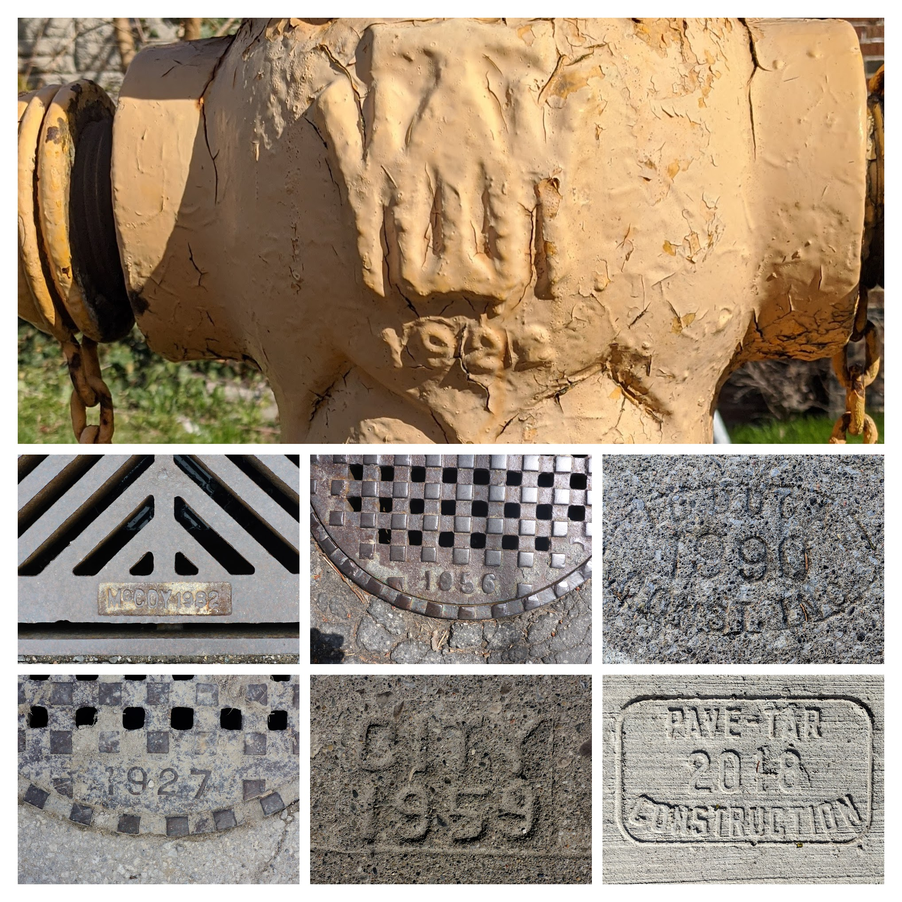
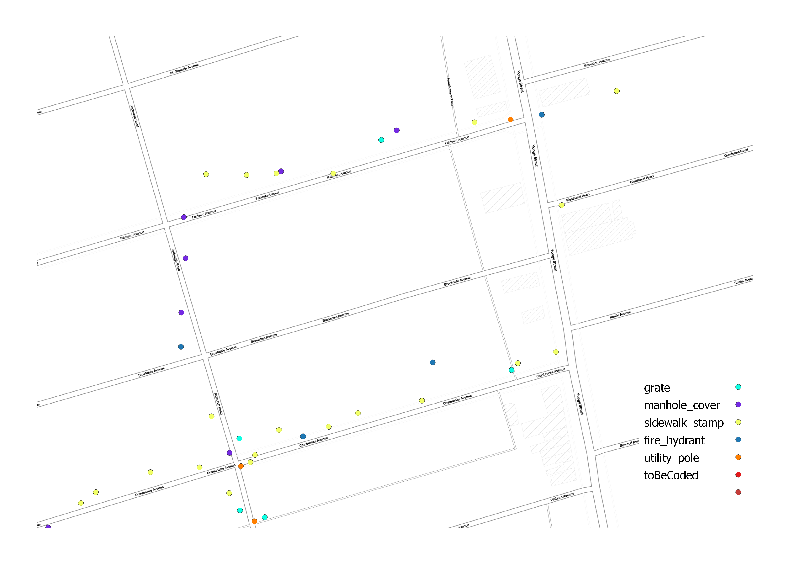
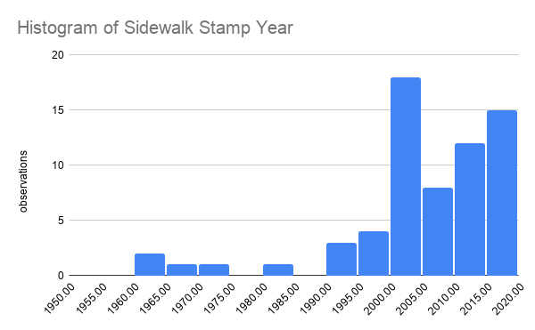

# Local Geography Project

This project came to life in March 2020 during the COVID-19 pandemic. Daily neighbourhood walks led to a more careful inspection of the hitherto mundane urban infrastructure: sidewalks, manhole covers, grates, fire hydrants, utility poles, etc. These objects are commonly stamped with their year of construction/manufacture, make and model. A layer of neighbourhood history was hiding in plain sight, waiting to be uncovered!

See this [interactive map](https://storage.googleapis.com/local-geography/webmaps/qgis2web_2020_04_13-23_22_29_236231/index.html).

Some of the key enabling technologies for this project are:
* Ubiquitous GPS-enabled cameras (i.e. smartphones) which by default geotag images via [Exif](https://en.wikipedia.org/wiki/Exif)
* Python and relevant libraries for scripting the image processing and geojson creation
* Open-source GIS ([QGIS](https://qgis.org/)) for viewing, editing and coding the collected data

## Workflow

1. Go on a physically-distanced walk in your neighbourhood. Take some photos of pieces of infrastructure clearly showing date and any other identifying marks.
2. Download the photos and run them through a script that generates a geojson file with point locations, placeholder fields (infrastructure type, year, mark) and URLs to images.
3. Upload images to image hosting site/bucket (e.g. AWS, Google Cloud).
4. Open the geojson file in GIS software (or a text editor if you really want) and code the images with date and other relevant attributes.
5. Contribute the product of your labour to the master geojson file for your neighbourhood.
6. Analyze  the master geojson file to answer questions such as "what's the average age of fire hydrants in my neighbourhood?", "which streets have the newest sidewalks?" and "which companies were winning paving contracts in the 1990s?".
7. Start a new day and return to step 1.

## Objects

Objects are represented in the geojson format, with the following properties:

* `type`. Category: `sidewalk_stamp`, `manhole_cover`, `grate`, `fire_hydrant`, `utility_pole`. Can be extended as new infrastructure types are captured.
* `yearLabelled`. Integer
* `mark`. String.
* `imageURI`. String

Fields can be coded:
* `none` - where not available
* `not_readable` - where not readable

## Script

Requires these Python packages: GPSPhoto, exifread, Pillow, piexif

Instructions for running on free cloud services (e.g. Google Collab) forthcoming.

